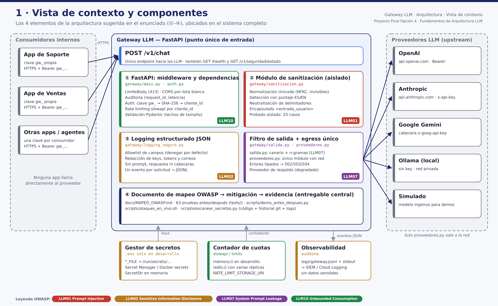

# Gateway LLM Propio con Seguridad de Nivel Producción

[](https://github.com/cesarmv85-del/fundamentos-arquitectura-llm-gateway-owasp/actions/workflows/ci.yml)

**Proyecto Final · Opción 4** — Fundamentos de Arquitectura LLM (BSG Institute) · Autor: César ([@cesarmv85-del](https://github.com/cesarmv85-del))
*El marco OWASP Top 10 para LLMs (2025), aplicado — no solo citado.*

Backend FastAPI que actúa como **única puerta** entre las aplicaciones de la organización y los proveedores de LLM (OpenAI, Anthropic, Google Gemini, Ollama o un proveedor simulado), con cuatro mitigaciones OWASP **demostrables en vivo**, cada una con su caso de ataque antes/después.

| OWASP 2025 | Mitigación | Módulo |
|---|---|---|
| LLM01 Prompt Injection | Normalización Unicode + detección ES/EN con puntaje + neutralización de delimitadores + encapsulado; rechazo antes de gastar tokens | `gateway/sanitizacion.py` |
| LLM02 Sensitive Information Disclosure | `SecretStr`/`*_FILE`, claves de cliente solo como hash, errores genéricos, logs JSON con allowlist + redacción | `config.py`, `auth.py`, `logging_seguro.py` |
| LLM07 System Prompt Leakage | Token canario + detector de n-gramas sobre la salida | `gateway/salida.py` |
| LLM10 Unbounded Consumption | Rate limit **por clave** (slowapi), techo de `max_tokens`, límite de body, timeouts | `gateway/main.py` |

## Entregables

| Entregable del enunciado | Dónde está |
|---|---|
| Repositorio con el gateway funcional | Este repositorio: [`gateway/`](gateway/) |
| Documento de mapeo OWASP → mitigación → evidencia | [`docs/MAPEO_OWASP.md`](docs/MAPEO_OWASP.md) · versión Word: [`entregables/Mapeo_OWASP_Gateway_LLM.docx`](entregables/Mapeo_OWASP_Gateway_LLM.docx) |
| Casos de prueba con línea base (antes/después) | [`tests/`](tests/) (63 pruebas) · [`scripts/demo_antes_despues.py`](scripts/demo_antes_despues.py) · [`docs/evidencias/REPORTE_EVIDENCIA.md`](docs/evidencias/REPORTE_EVIDENCIA.md) |
| Video explicativo (22:40 min) | [`entregables/Video_Gateway_LLM_OWASP.mp4`](entregables/Video_Gateway_LLM_OWASP.mp4) · subtítulos [`.srt`](entregables/Video_Gateway_LLM_OWASP.srt) · guion [`docs/GUION_VIDEO.md`](docs/GUION_VIDEO.md) |
| Diseño de arquitectura | [`docs/ARQUITECTURA.md`](docs/ARQUITECTURA.md) · 6 diagramas en [`docs/arquitectura/`](docs/arquitectura/) |



## Quick start (sin API keys)

```bash
git clone https://github.com/cesarmv85-del/fundamentos-arquitectura-llm-gateway-owasp.git && cd fundamentos-arquitectura-llm-gateway-owasp
python3.12 -m venv venv && source venv/bin/activate
pip install -r requirements.txt
cp .env.example .env

# 1. Emitir una clave de cliente (el gateway solo guarda su SHA-256)
python scripts/generar_clave_cliente.py equipo_soporte
#    → pegue "equipo_soporte:<hash>" en GATEWAY_CLIENT_KEYS_SHA256 del .env
export GW_KEY=gw_...   # la clave impresa

# 2. Levantar el gateway (proveedor simulado por defecto)
uvicorn gateway.main:app --port 8000

# 3. Usarlo
curl -s -X POST localhost:8000/v1/chat \
  -H "Authorization: Bearer $GW_KEY" -H "Content-Type: application/json" \
  -d '{"mensaje":"¿Puedo devolver un producto que compré hace 20 días?"}'
```

## Evidencia antes / después

```bash
pytest -v                               # 63 pruebas: cada mitigación con línea base y protegido
python scripts/demo_antes_despues.py    # tabla + docs/evidencias/REPORTE_EVIDENCIA.md
python scripts/escanear_secretos.py     # código + historial git + logs sin secretos
```

En vivo (dos terminales):
```bash
make linea-base M=LLM01          # mitigación apagada
./scripts/ataques_en_vivo.sh llm01   # el ataque tiene éxito
make protegido                   # todas activas
./scripts/ataques_en_vivo.sh llm01   # el ataque es bloqueado
```
`M` puede ser `LLM01`, `LLM02`, `LLM07` o `LLM10`. Ver el guion completo en `docs/GUION_VIDEO.md`.

## API

| Método | Ruta | Auth | Descripción |
|---|---|---|---|
| `POST` | `/v1/chat` | `Bearer gw_…` | **Único** endpoint hacia los LLM. Body: `mensaje` (≤4000), `max_tokens` (≤512), `temperature` (0–1.5), `proveedor` (opcional) |
| `GET` | `/v1/seguridad/estado` | `Bearer gw_…` | Mitigaciones activas y límites vigentes |
| `GET` | `/health` | — | Liveness |

Códigos: `400` inyección bloqueada · `401` clave inválida · `413` body excesivo · `422` fuera de límites · `429` rate limit (+`Retry-After`) · `502/503/504` fallo upstream con mensaje claro y `request_id`.

## Usar un proveedor real

```bash
# .env
PROVEEDOR_PRINCIPAL=openai          # anthropic | google | ollama
OPENAI_API_KEY=...                  # o OPENAI_API_KEY_FILE=/run/secrets/openai
PROVEEDOR_RESPALDO=ollama           # opcional: degradación controlada
```

## Docker

```bash
docker build -t gateway-llm .
docker run --rm -p 8080:8080 --env-file .env -e ENTORNO=produccion gateway-llm
```
Con `ENTORNO=produccion` el gateway **no arranca** si alguna mitigación está apagada, si hay una falla simulada configurada o si no hay claves de cliente.

## Relación con el repositorio del curso

Construido sobre las convenciones de [`Repo-Fundamentos-Arquitectura-LLM`](https://github.com/arojaspa76/Repo-Fundamentos-Arquitectura-LLM): FastAPI + Python 3.12, `os.getenv()`/`.env`, `slowapi`, dominio *Tienda Andina*, modo simulado y Dockerfile no-root (Sesiones 4–6). Corrige explícitamente cinco brechas de `session_4/backend/main.py` y `session_5/backend/proveedores.py` (ver `docs/MAPEO_OWASP.md` §2).
