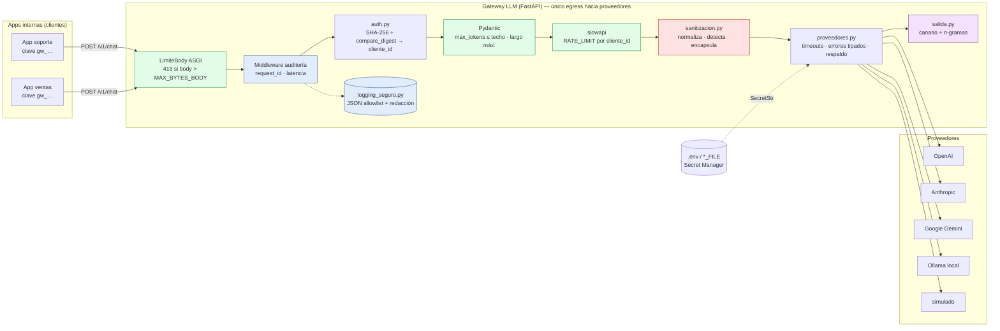

# Arquitectura y bitácora de fases

## Diagramas (imágenes)

| # | Vista | Archivo |
|---|---|---|
| 1 | Contexto y componentes (los 4 elementos de la arquitectura sugerida) | `docs/arquitectura/01_vista_contexto.png` |
| 2 | Cadena de controles en orden real de ejecución | `docs/arquitectura/02_pipeline_controles.png` |
| 3 | Secuencia de `POST /v1/chat` | `docs/arquitectura/03_secuencia_solicitud.png` |
| 4 | Seguridad: OWASP → mitigación → módulo → evidencia | `docs/arquitectura/04_vista_seguridad_owasp.png` |
| 5 | Logging seguro y degradación controlada | `docs/arquitectura/05_logging_y_degradacion.png` |
| 6 | Despliegue en producción (propuesta) | `docs/arquitectura/06_despliegue_produccion.png` |

Fuentes editables en `docs/arquitectura/svg/`.

**Orden real de los controles** (verificado con pruebas): LimiteBody → CORS → Auditoría → Autenticación (401) → Validación Pydantic (422, no consume cuota) → Rate limit (429) → Sanitización (400) → Proveedor (502/503/504 o respaldo) → Filtro de salida.

## 1. Vista de componentes



Colores: rojo LLM01 · azul LLM02 · violeta LLM07 · verde LLM10.

## 2. Estructura del repositorio

```
proyecto_04_gateway_llm/
├── gateway/
│   ├── main.py            ← app FastAPI, endpoint único /v1/chat, middlewares, manejadores de error
│   ├── config.py          ← configuración por entorno, SecretStr, *_FILE, interruptores MITIGACION_*
│   ├── auth.py            ← claves de cliente (solo SHA-256) → cliente_id
│   ├── sanitizacion.py    ← LLM01 (módulo puro, testeable aislado)
│   ├── salida.py          ← LLM07 (módulo puro)
│   ├── proveedores.py     ← ÚNICO módulo que habla con proveedores
│   └── logging_seguro.py  ← LLM02: formateador JSON allowlist + redacción
├── tests/                 ← 63 pruebas: línea base vs. protegido por mitigación
├── scripts/
│   ├── instalar.sh             ← instalación automática en Linux
│   ├── prueba_humo.sh          ← verificación de punta a punta
│   ├── demo_antes_despues.py   ← evidencia reproducible → docs/evidencias/REPORTE_EVIDENCIA.md
│   ├── ataques_en_vivo.sh      ← curl contra el servidor (para el video)
│   ├── escanear_secretos.py    ← código + historial git + logs
│   └── generar_clave_cliente.py
├── docs/
│   ├── MAPEO_OWASP.md          ← ENTREGABLE CENTRAL
│   ├── MANUAL_INSTALACION.md   ← instalación, configuración y producción
│   ├── MANUAL_USUARIO.md       ← uso, administración y auditoría
│   ├── ARQUITECTURA.md         ← este archivo
│   ├── GUION_VIDEO.md
│   └── evidencias/             ← reporte + logs del modo protegido
├── entregables/            ← Word del mapeo, video y subtítulos
├── .github/workflows/ci.yml ← instalador + pruebas + prueba de humo en cada push
├── .devcontainer/           ← GitHub Codespaces: Linux con todo instalado
├── Dockerfile · Makefile · requirements.txt · .env.example · .gitignore
```

## 3. Decisiones de diseño

| Decisión | Alternativa descartada | Por qué |
|---|---|---|
| Fábrica `crear_app(cfg)` | App global única | Permite levantar la misma app con y sin cada mitigación en la misma corrida de pruebas → evidencia antes/después automática |
| Interruptores `MITIGACION_*` | Ramas git "vulnerable"/"segura" | Un solo código, la diferencia es exactamente la mitigación; y `ENTORNO=produccion` los bloquea |
| Rate limit por clave | Por IP (Sesión 4) | NAT corporativo y abusadores multi-IP (error común #2) |
| Rate limit antes de sanitizar (y después de validar) | Después de sanitizar | Los intentos de inyección en bucle también consumen cuota; las solicitudes malformadas (422) no |
| Rechazar la inyección (400) | Solo "limpiar" y enviar | Enviar un texto ya identificado como ataque gasta tokens y apuesta al alineamiento del modelo |
| Filtro de salida LLM07 además de LLM01 | Confiar solo en la entrada | Defensa en profundidad: ningún filtro de entrada es completo |
| Allowlist de campos de log | Lista negra ("no loguear prompt") | Denegar por defecto: un campo nuevo no se filtra por olvido |
| Proveedor sin key → error | Caer a simulado (patrón Sesión 5) | En producción una respuesta simulada silenciosa es una degradación engañosa |
| `httpx` directo | SDKs oficiales | Un único cliente HTTP, errores homogéneos y la key siempre en cabecera |
| Contador en memoria por defecto | Redis obligatorio | Simple para el curso; `RATE_LIMIT_STORAGE_URI=redis://` para varias réplicas |

## 4. Bitácora de las 5 fases (enunciado §7)

**Fase 1 — Pensar como atacante.** Se auditó `session_4/backend/main.py` y `session_5/backend/proveedores.py` y se escribieron los casos de ataque antes de cualquier defensa: inyección que cambia la política de devoluciones (+ variante zero-width), exfiltración del system prompt, ráfaga y `max_tokens=50000`, error upstream con `?key=` en la URL, prompt con DNI/correo en logs. Resultado: `docs/MAPEO_OWASP.md` §2 (5 hallazgos).

**Fase 2 — Gateway básico y línea base.** Endpoint único + proveedores + autenticación. Con todas las mitigaciones apagadas, cada ataque de la Fase 1 **tiene éxito** → pruebas `test_linea_base_*` (en verde = el ataque funciona).

**Fase 3 — Mitigaciones una por una.** Orden sugerido: LLM10 → LLM01 → LLM07 → LLM02 (errores y logs). Tras cada una se re-ejecuta su caso: `test_con_mitigacion_*` en verde y las demás sin regresión.

**Fase 4 — Logging estructurado seguro.** Middleware de auditoría + `FormateadorJSONSeguro` (allowlist + redacción). Validado con el caso de PII (`test_con_mitigacion_log_no_contiene_prompt_pii_ni_claves`).

**Fase 5 — Documento de mapeo.** `docs/MAPEO_OWASP.md` + `docs/evidencias/REPORTE_EVIDENCIA.md` generado por script, más un ensayo manual con `uvicorn` + `curl` que reveló dos ajustes: comentarios en línea del `.env` que `python-dotenv` leía como valor, y el consumo de cuota por solicitudes bloqueadas (documentado como intencional). Además, `scripts/escanear_secretos.py` detectó en el primer commit una key de Google **falsa** escrita literalmente en dos comandos de ejemplo de la documentación: se reemplazó por una generada en tiempo de ejecución (`AIza$(openssl rand -hex 18)`) y se reescribió el commit. Es exactamente el tipo de error que el control debe atrapar antes de que llegue a un remoto.
